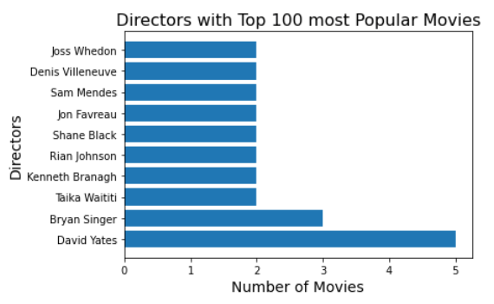

# Phase 1 Project - Microsoft Studios Proposal

**Author**: Jim Petoskey

## Overview

Microsoft wants to start a movie studio, but they don't know what kind of movie they should make or who they should hire to work on it. IMDB is a website that contains a lot of information on movies and produces many CSV's for us to glean information about what makes a movie successful.  By joining some of these CSV's using Pandas sofware we can create and compare some of the important aspects of making movies, such as their director, genre, and production budget.  After parsing through the data, it seems that around 10 directors have experience making multiple very popular films, the genre should combine action and adventure and likely Sci-Fi or Fantasy, and Microsoft should spend between 50 and 300 million dollars for their production budget.

## Business Problem

Microsoft is starting a movie studio, but doesn't have experience in show business, so I gathered data to make recommendations for their first movie.

My questions are:

Which directors have the most experience directing high grossing movies?

Do some movie genre's consistently produce high grossing movies?
If so, which genres?

How much do studios spend on high grossing movies?


## Data

The data for this project comes largely from IMDB, which considers itself to be, "the world's most popular and authoritative source for movie, TV and celebrity content" IMDB Source. Some of the additional sources include The Movie Database, The Numbers - Where Data and the Movie Business Meet, Box Office Mojo, and Rotten Tomatoes. These databases contain valuable data such as, worldwide gross, genre, director names and their respective movies. Each of these categories were important in soliving the questions posed in this project.

Each of the variables, worldwide gross, genre, and director names being connected to their respective movies, required manipulation of the data. Worldwide gross was stored as a string with '$' signs and commas and needed to be converted into an integer. Genre, needed to be converted into a string from an object, then exploded in order to track distinct genres, rather than combinations of genres. In addition, director names needed to be joined with their codes in order to be useful. Other data manipulation was necessary to sort and chunk dataframes, to clean dataframes of duplicates before joining them, and to add missing or correct erroneous data.


## Methods

There are three topics modeled in this project.

Directors of Top 100 Most Popular Movies

Using the top 100 highest rated movies to find the best directors, then displaying which of them directed the most highly rated movies, would provide a short-list of who Microsoft should ask to direct their movie. Initially, I thought the ratings category from IMDB would be best, but the highest rated movies on IMDB did not produce relevant results. Luckily, the popularity rating from TMDB did produce movies that are highly acclaimed, so I used that category to select the top directors.
Using a popularity rating to determine which directors to contact for making Microsofts movie is relevant because Microsoft wants their movie to be well-accepted and reviewed, in addition to making money.
Genres of Top 100 Grossing Movies

Finding the genres of the Top 100 Grossing Movies, then displaying them in a histogram by distinct genre and by genre combination allows Microsoft to gauge which genres are most popular and which genre combinations are likely to produce a high grossing movie. The genre category illuminates another closely related concept - that science fiction series, especially those based on novels, are likely to be very popular and lucrative.
Production Budget vs Worldwide Gross for Top 100 Grossing Movies

This was the simplest model, but important for Microsoft to understand how much money they should spend to create a high-grossing movie. Improvements in this model came from experimenting with Seaborn and figuring out how to display the best-fit line, which indicates that the more studios spend on films, the more likely they are to have a higher gross. One caveat to this conclusion is that this is based on data from the top 100 grossing films, so this group is already selected to have a high gross and does not include flops.

## Results

I am confident that both genre and popular directors are valid to consider in the initial phases of planning to produce a movie and that the data I presented on genre and popular directors is valid.

However, I am less sure about the conclusion that the more studios spend on movies, the more they make. I think that is too far-reaching, but it is a correlation among the top 100 highest grossing movies, so there is some truth to my recommendation of spending at least $50 million if Microsoft is hoping to produce a high grossing movie.


Here is an example of how to embed images from your sub-folder:

### Visual 1


### Visual 2


### Visual 3


## Conclusions

Microsoft should start looking for and purchase a sci-fi or fantasy novel series to produce as a movies series as soon as possible. Or, they should purchase the rights to an existing series, as Disney has done with Star Wars.

I recommend that Microsoft consider the Hugo Award winners, an award given in the fantasy genre, in particular N.K. Jemison's Broken Earth trilogy. Sony currently owns the rights to the Broken Earth Trilogy movies, and they are in advanced stages of writing, but it might be possible to purchase this series and make three movies, with follow-up fan-fiction similar to Fantastic Beasts in the Harry Potter series.

As for the director Microsoft selects, I recommend reaching out to David Yates and John Favreau before any others in the top 10 due to their experience working with sci-fi and fantasy series. If Microsoft is leaning towards having humor/satire be a main component in the movie, then Taika Waititi would also be a great director.

The genre analysis is particularly interesting because of the importance it places on producing an action movie, and most likely a movie with an action, adventure, and sci-fi/fantasy genre combination.

Spending money won't necessarily make a good movie, but an increase in production budget did correlate with an increase in worldwide gross for the top 100 grossing movies. Meaning, Microsoft should plan to spend at least $50 million producing each movie.

In the future, I would like to identify the best writers, most likely gathering their names from the most popular movies in the TMDB csv, as I did with the directors.

## For More Information

Please review our full analysis in [our Jupyter Notebook](https://github.com/jpetoskey/dsc-project-template/blob/template-mvp/Phase%201%20Project%20-%20Microsoft%20Studios%20Proposal%20-%20Jim%20Petoskey.ipynb) or our [presentation](https://github.com/jpetoskey/dsc-project-template/blob/template-mvp/Phase%201%20Project%20Presentation%20-%20Microsoft%20Studios%20-%20Jim%20Petoskey.pdf).

For any additional questions, please contact **Jim Petoskey - Jim.Petoskey.146@gmail.com**

## Repository Structure

Describe the structure of your repository and its contents, for example:

```
├── README.md                           <- The top-level README for reviewers of this project
├── dsc-phase1-project-template.ipynb   <- Narrative documentation of analysis in Jupyter notebook
├── DS_Project_Presentation.pdf         <- PDF version of project presentation
├── data                                <- Both sourced externally and generated from code
└── images                              <- Both sourced externally and generated from code
```
